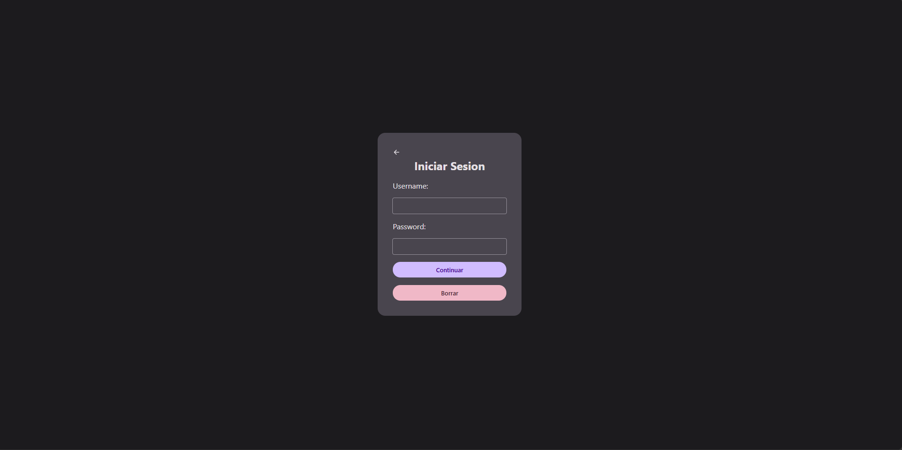

# Felpudo Games | Proyecto con Django

## Descripción del Proyecto

Este proyecto es una aplicación web que simula la página de inicio (landing page) y el sistema de autenticación de una plataforma de juegos, desarrollada con el framework web **Django**.

El objetivo principal de este proyecto fue demostrar mi capacidad para **aprender y aplicar una nueva tecnología de backend (Django)** para construir una solución web funcional y completa.

## Puntos Clave

- **Backend con Django:** El proyecto utiliza Django para gestionar la lógica del servidor, las rutas URL y el sistema de autenticación de usuarios.
- **Base de Datos SQLite:** Se implementó una base de datos relacional con SQLite, demostrando mi habilidad para trabajar con bases de datos en un entorno ágil y de bajo costo.
- **Sistema de Autenticación Funcional:** Permite a los usuarios iniciar sesión de forma segura, gestionando las sesiones y los datos de usuario.
- **Diseño de Interfaz:** La landing page cuenta con un diseño visualmente atractivo y efectos de cursor interactivos, aunque **no es responsive y está diseñada para pantallas de escritorio**.

## Tecnologías Utilizadas

- **Backend:** Python, Django
- **Base de Datos:** SQLite
- **Frontend:** HTML, CSS, JavaScript

## Cómo ejecutar el proyecto

1.  **Clonar el repositorio:**
    ```bash
    git clone https://github.com/dwayne7890/proyecto_final_web_services.git
    ```
2.  **Entrar al directorio del proyecto:**
    ```bash
    cd proyecto_final_web_services
    ```
3.  **Instalar las dependencias de Python:**
    ```bash
    pip install django
    ```
4.  **Aplicar las migraciones de la base de datos:**
    ```bash
    python manage.py migrate
    ```
5.  **Crear un superusuario (opcional pero recomendado):**
    ```bash
    python manage.py createsuperuser
    ```
6.  **Iniciar el servidor de desarrollo:**
    ```bash
    python manage.py runserver
    ```
7.  **Abrir en el navegador:**
    Ve a `http://127.0.0.1:8000/` para ver la aplicación en funcionamiento.

---

### Capturas de Pantalla


Vista de la Landing Page


Vista de la Login Page

---

### Pablo Hernández
[Mi Linkedin](https://www.linkedin.com/in/pablo-hernandez-785880332/)
